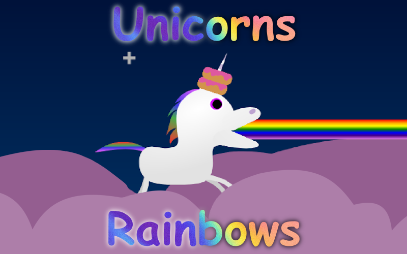

# Unicorns and Rainbows

[Made for JS13K 2026](https://js13kgames.com/)

Destroy the yucky things!

## Controls

### Keyboard
**Move:** Arrow Keys  
**Shoot:** Z  
**Beam:** X  
**Slow Move:** Shift

### Touchscreen
**Move:** Finger  
**Shoot:** (While moving)  
**Beam:** Another Finger  
**Slow Move:** Move finger slower

### Gamepad
**Move:** Arrows or Sticks 
**Shoot:** A/X or RB/R1  
**Beam:** RT/R2  
**Slow Move:** LT/L2

## Building
#### requirements
- [Haxe](https://haxe.org/)
- [7-zip](https://www.7-zip.org/)
- [npm](https://www.npmjs.com/)
	- [svgo](https://www.npmjs.com/package/svgo)
	- [uglifyjs](https://www.npmjs.com/package/uglify-js)
	- [html-minifier](https://www.npmjs.com/package/html-minifier)
	- [roadroller](https://www.npmjs.com/package/roadroller) (optional)

The `ROADROLLER` flag may be provided to compress using roadroller.  
e.g.   
`haxe build.hxml -D ROADROLLER`
